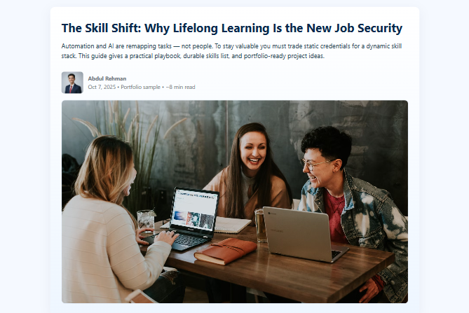



  

 

# The Skill Shift — Portfolio Sample

A clean, one-page portfolio sample built in plain HTML/CSS by **Abdul Rehman**, designed for recruiter-friendly presentation and quick sharing.

---

### 🌟 Highlights
- Fully responsive HTML layout  
- Downloadable PDF version  
- Integrated favicon (AR logo)  
- SEO & schema-optimized structure  

### 📂 Files Included
- `the-skill-shift-portfolio.html` — Main portfolio page  
- `skill-shift-summary.pdf` — Downloadable one-page summary  
- `ar-favicon-64-B.svg` — Custom logo  

### 🔗 Live Links
- [Freelancer Profile](https://www.freelancer.com/u/AbdulRehman3123?frm=AbdulRehman3123&sb=t)  
- [PDF Version](https://drive.google.com/file/d/18KQqf0ytvX6mpwtzgnlX-154QcOIIuOE/view?usp=sharing)  
- [Live Demo](https://abdulrehman3132.github.io/Portfolio/)

---

## 🧭 Overview
This repository contains a polished, responsive HTML portfolio piece titled **"The Skill Shift: Why Lifelong Learning Is the New Job Security"**.  
It demonstrates a project-first approach to portfolios — short, verifiable mini-project ideas, a downloadable one-page summary, and accessible, print-optimized markup.

---

## 🧱 Highlights
- ✅ Responsive single-page HTML (`index.html`)  
- ✅ Downloadable PDF summary (`skill-shift-summary.pdf`)  
- ✅ Branded favicon (`ar-favicon-64-B.svg`)  
- ✅ SEO & Open Graph meta tags for social sharing  
- ✅ Print styles for clean "Save as PDF" exports  

---

## 📁 Files in this repo
- `index.html` — Main portfolio page (deploys via GitHub Pages)  
- `skill-shift-summary.pdf` — One-page downloadable summary for recruiters  
- `ar-favicon-64-B.svg` — Simple AR favicon used in the page head  
- `LICENSE` — MIT License (permissive)  
- `README.md` — This file  

---

## 🚀 How to Deploy / Use
1. The site is already published on GitHub Pages:  
   👉 `https://abdulrehman3132.github.io/Portfolio/`  
2. To host locally, open `index.html` in your browser.  
3. To change the downloadable PDF link to GitHub direct download:  
https://raw.githubusercontent.com/AbdulRehman3132/Portfolio/main/skill-shift-summary.pdf

yaml
Copy code
This will let visitors download directly without Google Drive preview.  

---

## 🧩 Contributing / Editing
- Replace text, screenshots, or add project links to adapt this as a case study.  
- Add your own screenshots to the repo and display them in `index.html` (recommended for trust).  

---

## 🏷️ Topics / Tags
`portfolio`, `html`, `frontend`, `resume`, `freelancer-sample`, `seo`, `accessibility`

---

© 2025 **Abdul Rehman** — Built for professional portfolio use  
🔗 Freelancer: [Abdul Rehman](https://www.freelancer.com/u/AbdulRehman3123?frm=AbdulRehman3123&sb=t)
